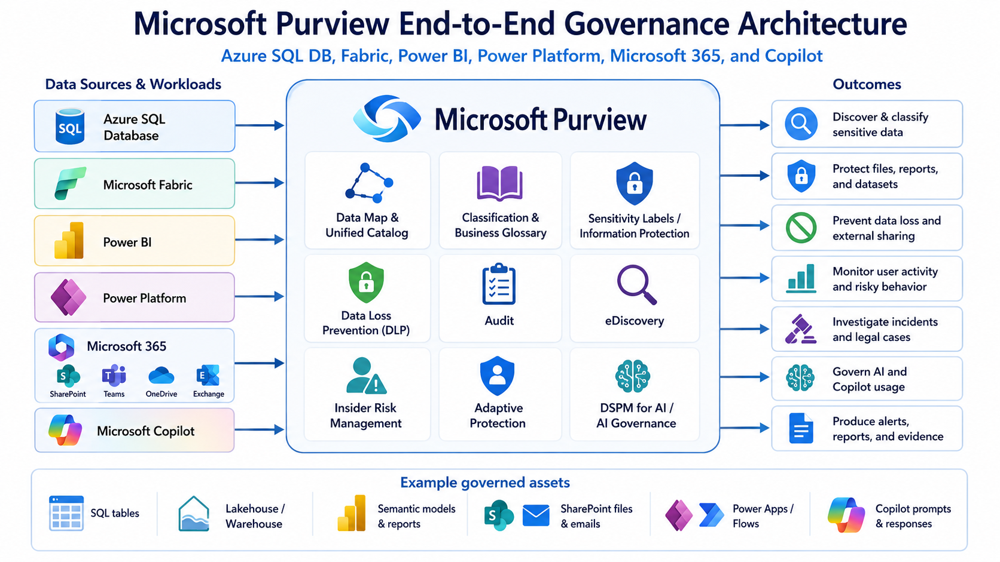

## Quick Navigation

- [High-Level Architecture](#3-high-level-architecture)
- [Part A - Foundation Setup](#part-a--foundation-setup)
- [Part B - Create Sample Data Sources](#part-b--create-sample-data-sources)
- [Part C - Microsoft Purview Data Governance](#part-c--microsoft-purview-data-governance)
- [Part D - Microsoft Purview Information Protection and DLP](#part-d--microsoft-purview-information-protection-and-dlp)
- [Part E - Audit, Risk, and Investigation](#part-e--audit-risk-and-investigation)
- [Part F - AI Governance and Final Validation](#part-f--ai-governance-and-final-validation)

### Section Navigation

- [1. Purpose of this Guide](#1-purpose-of-this-guide)
- [2. Target Scenario](#2-target-scenario)
- [3. High-Level Architecture](#3-high-level-architecture)
- [4. Important Implementation Notes](#4-important-implementation-notes)
- [5. Lab Resources to Be Created](#5-lab-resources-to-be-created)
- [6. Create Users in Microsoft Entra ID](#6-create-users-in-microsoft-entra-id)
- [7. Create Security Groups](#7-create-security-groups)
- [8. Assign Licenses](#8-assign-licenses)
- [10. Assign Microsoft Purview Role Groups](#10-assign-microsoft-purview-role-groups)
- [11. Create Azure SQL Database](#11-create-azure-sql-database)
- [12. Create Microsoft Fabric Workspace and Sample Data](#12-create-microsoft-fabric-workspace-and-sample-data)
- [13. Create Power BI Semantic Model and Report](#13-create-power-bi-semantic-model-and-report)
- [17. Create Collections and Governance Structure](#17-create-collections-and-governance-structure)
- [20. Create Sensitivity Labels](#20-create-sensitivity-labels)
- [21. Configure Microsoft 365 DLP](#21-configure-microsoft-365-dlp)
- [24. Configure Audit](#24-configure-audit)
- [26. Configure Insider Risk Management](#26-configure-insider-risk-management)
- [28. Configure eDiscovery](#28-configure-ediscovery)

Microsoft Purview End-to-End Data
Governance Implementation Guide
Trainer Manual for Lab Environment Implementation
Designed for guided implementation, validation, and review of Microsoft Purview
governance, protection, risk, investigation, and AI governance concepts in a structured
lab environment.
Document Type: Lab Manual
Audience: Implementation teams, trainers, architects, and governance administrators
Use: Setup, validation, and governance testing in a lab environment
Quick Reference Summary
Objective: Establish a complete Microsoft Purview lab that demonstrates discovery,
classification, labeling, DLP , insider risk, adaptive protection, audit, eDiscovery, and AI
governance in a controlled training environment.
Primary platforms: Azure SQL Database, Microsoft Fabric, Power BI, Microsoft 365,
Power Platform, Microsoft Purview, and Microsoft Copilot.
Core outcomes: Identify sensitive data, apply governance metadata, protect content
with labels and DLP , detect risky behavior, investigate incidents, and validate
governance controls through guided scenarios and reporting.
Recommended use: Follow the guide in sequence for implementation, use the
validation checklist to confirm readiness, and return to the executive summary for rapid
workshop, demo, or lab review.
### 1. Purpose of this Guide
This guide explains how to implement Microsoft Purview governance and compliance
controls.
The implementation covers:
- Azure SQL Database governance
- Microsoft Fabric workspace governance
- Power BI governance
- Microsoft 365 data protection

- Power Platform data policies
- Microsoft Copilot and AI governance
- Data classification
- Sensitivity labels and protection
- Data Loss Prevention policies
- Insider Risk Management
- Adaptive Protection
- Audit and activity investigation
- eDiscovery for legal and compliance investigation
- Risk alerts, investigation reports, and evidence collection
The goal is to create a complete training-ready environment where participants can
understand not only how to configure Microsoft Purview, but also how to validate
whether the controls are working.
### 2. Target Scenario
The organization stores customer data in multiple systems:
- Azure SQL Database stores customer master records.
- Microsoft Fabric stores analytical data in a Lakehouse and Warehouse.
- Power BI reports expose customer risk and financial summaries.
- SharePoint, OneDrive, Teams, and Exchange are used for collaboration.
- Power Platform users build apps and flows using Dataverse and connectors.
- Microsoft Copilot is used to summarize and generate content from Microsoft 365
data.
The organization wants to answer these governance questions:
- Where is sensitive customer data stored?
- Which tables, files, reports, and documents contain sensitive data?
- Who accessed sensitive data?
- Who shared sensitive data externally?
- Which users are creating risk?

- What data is going out of the organization?
- Which AI and Copilot activities may expose sensitive data?
- How can legal and compliance teams collect evidence?
- How can protection become stricter automatically for risky users?
### 3. High-Level Architecture

### 4. Important Implementation Notes
Before starting, remember the following:
1. Microsoft Purview has multiple solution areas. Not every setting is configured
from one screen.
2. Power Platform DLP is configured mainly from the Power Platform admin center,
not only from Microsoft Purview.
3. Fabric and Power BI DLP is configured from Microsoft Purview DLP policies.
4. Audit and eDiscovery are configured from Microsoft Purview.
5. Insider Risk Management and Adaptive Protection require correct licensing and
role permissions.

6. DSPM for AI helps identify AI-related data security risks, especially around
Copilot and generative AI usage.
7. Business fields such as RiskCategory should normally be governed using
glossary terms or metadata, not custom classifications.
8. Sensitive fields such as PAN, Aadhaar, credit card number, passport number,
email address, and phone number should be governed using classifications,
labels, DLP , and audit.

### 5. Lab Resources to Be Created
Create the following resources during this implementation.
#### 5.1 Users
| User | Purpose |
|---|---|
| purview.admin@yourdomain.com | Main administrator |
| data.owner@yourdomain.com | Business data owner |
| fabric.user@yourdomain.com | Fabric and Power BI user |
| pp.maker@yourdomain.com | Power Platform maker |
| risk.user@yourdomain.com | User for testing risky activities |
| legal.reviewer@yourdomain.com | Legal and eDiscovery reviewer |
#### 5.2 Security Groups
| Group | Members |
|---|---|
| SG-Purview-Admins | purview.admin |
| SG-Data-Owners | data.owner |
| SG-Fabric-Users | fabric.user, risk.user |
| SG-PowerPlatform-Makers | pp.maker, risk.user |
| SG-Legal-Reviewers | legal.reviewer |

| Group | Members |
|---|---|
| SG-High-Risk-Users-Test | risk.user |
#### 5.3 Azure Resources
| Resource | Name |
|---|---|
| Resource group | rg-purview-governance-lab |
| Azure SQL Server | sqlsrv-purviewlab-<uniqueid> |
| Azure SQL Database | sqldb-customer360 |
| Azure Key Vault | kv-purviewlab-<uniqueid> |
#### 5.4 Microsoft Fabric Resources
| Resource | Name |
|---|---|
| Workspace | WS-Governance-Lab |
| Lakehouse | lh_customer360 |
| Warehouse | wh_customer360 |
| Semantic model | sm_customer360_sensitive |
| Report | rpt_customer360_sensitive |
#### 5.5 Microsoft 365 Resources
| Resource | Name |
|---|---|
| SharePoint site | Governance Lab Site |
| Teams team | Governance Lab Team |
| SharePoint folder | Customer Records |
| SharePoint folder | Legal Evidence |
| SharePoint folder | AI Generated Content |
| SharePoint folder | External Sharing Test |

#### 5.6 Power Platform Resources
| Resource | Name |
|---|---|
| Environment | PP-Governance-Lab |
| Dataverse table | Customer Risk Review |
| Power App | Customer Risk Review App |
| Power Automate flow | Flow - Send Customer Risk Data Externally |

## Part A — Foundation Setup
### 6. Create Users in Microsoft Entra ID
#### Step 6.1: Open Microsoft Entra Admin Center
1. Go to the Microsoft Entra admin center.
2. Select Identity.
3. Select Users.
4. Select New user.
5. Select Create new user.
#### Step 6.2: Create the Purview Administrator
Create the first user:
User principal name: purview.admin@yourdomain.com
Display name: Purview Admin
Password: Auto-generate or custom
Account enabled: Yes
Usage location: Select your country/region
Select Review + create, then select Create.
#### Step 6.3: Create Remaining Users
Repeat the same steps for:
data.owner@yourdomain.com

fabric.user@yourdomain.com
pp.maker@yourdomain.com
risk.user@yourdomain.com
legal.reviewer@yourdomain.com

### 7. Create Security Groups
#### Step 7.1: Open Groups
1. Go to the Microsoft Entra admin center.
2. Select Identity.
3. Select Groups.
4. Select New group.
#### Step 7.2: Create the Purview Admin Group
Create:
Group type: Security
Group name: SG-Purview-Admins
Membership type: Assigned
Members: purview.admin@yourdomain.com
Select Create.
#### Step 7.3: Create Remaining Groups
Create the following groups:
SG-Data-Owners
SG-Fabric-Users
SG-PowerPlatform-Makers
SG-Legal-Reviewers
SG-High-Risk-Users-Test
Add members as described in the group table earlier.

### 8. Assign Licenses
#### Step 8.1: Open Microsoft 365 Admin Center
1. Go to the Microsoft 365 admin center.
2. Select Users.
3. Select Active users.
4. Select a user.
5. Select Licenses and apps.
#### Step 8.2: Assign Available Licenses
Assign appropriate licenses to all lab users.
For the full set of features in this guide, the tenant normally requires Microsoft 365 E5 or
equivalent Microsoft Purview compliance capabilities, plus Power BI/Fabric and Power
Platform licensing as required.
Assign licenses to:
purview.admin@yourdomain.com
data.owner@yourdomain.com
fabric.user@yourdomain.com
pp.maker@yourdomain.com
risk.user@yourdomain.com
legal.reviewer@yourdomain.com
Select Save changes.

9. Assign Administrator Roles
#### Step 9.1: Open Microsoft Entra Roles
1. Go to Microsoft Entra admin center.
2. Select Identity.
3. Select Roles & admins.
#### Step 9.2: Assign Roles to purview.admin
Assign the following roles to purview.admin@yourdomain.com:

Compliance Administrator
Security Administrator
Fabric Administrator
Power Platform Administrator
Exchange Administrator
SharePoint Administrator
For lab setup only, Global Administrator may be assigned temporarily. Remove it after
setup.

### 10. Assign Microsoft Purview Role Groups
#### Step 10.1: Open Purview Role Groups
1. Go to Microsoft Purview portal.
2. Select Settings.
3. Select Roles and scopes.
4. Select Role groups.
#### Step 10.2: Assign Purview Roles
Assign:
| Role group | Member |
|---|---|
| Compliance Administrator | SG-Purview-Admins |
| Information Protection | SG-Purview-Admins |
| Data Loss Prevention | SG-Purview-Admins |
| Insider Risk Management | SG-Purview-Admins |
| Audit Manager | SG-Purview-Admins |
| eDiscovery Manager | SG-Legal-Reviewers |
| Data Governance Administrator | SG-Purview-Admins |
| Data Source Administrator | SG-Purview-Admins |

| Role group | Member |
|---|---|
| Data Curator | SG-Data-Owners |
If a role group is not visible, verify licensing, permissions, and whether the new
Microsoft Purview portal experience is enabled in the tenant.

## Part B — Create Sample Data Sources
### 11. Create Azure SQL Database
#### Step 11.1: Create resource group
1. Go to the Azure portal.
2. Search for Resource groups.
3. Select Create.
Enter the following values:
Subscription: Select your subscription
Resource group: rg-purview-governance-lab
Region: Select your preferred region
Select Review + create, then select Create.
#### Step 11.2: Create Azure SQL Server
1. In the Azure portal, search for SQL servers.
2. Select Create.
Enter the following values:
Resource group: rg-purview-governance-lab
Server name: sqlsrv-purviewlab-<uniqueid>
Location: Same as resource group
Authentication method: SQL authentication and Microsoft Entra authentication
Server admin login: sqladminuser
Password: Use a strong password
Select Review + create, then select Create.

#### Step 11.3: Create Azure SQL Database
1. In the Azure portal, search for SQL databases.
2. Select Create.
Enter the following values:
Resource group: rg-purview-governance-lab
Database name: sqldb-customer360
Server: sqlsrv-purviewlab-<uniqueid>
Compute + storage: Basic or General Purpose for lab
Backup storage redundancy: Locally-redundant backup storage
Select Review + create, then select Create.
#### Step 11.4: Configure firewall
1. Open the Azure SQL Server.
2. Select Networking.
3. Add your client IP address.
4. Enable Allow Azure services and resources to access this server if
appropriate for the lab.
5. Select Save.
#### Step 11.5: Open Query editor
1. Open sqldb-customer360.
2. Select Query editor.
3. Sign in using SQL authentication.
Use the following credentials:
Username: sqladminuser
Password: Your password
#### Step 11.6: Create sensitive customer table
Run this SQL script:
CREATE TABLE dbo.CustomersSensitive (
    CustomerId INT PRIMARY KEY ,

    FullName NVARCHAR(100),
    EmailAddress NVARCHAR(100),
    PhoneNumber NVARCHAR(20),
    CreditCardNumber NVARCHAR(30),
    PANNumber NVARCHAR(20),
    AadhaarNumber NVARCHAR(20),
    PassportNumber NVARCHAR(30),
    AnnualIncome DECIMAL(18,2),
    RiskCategory NVARCHAR(50),
    LastTransactionDate DATE
);
#### Step 11.7: Insert sample customer data
INSERT INTO dbo.CustomersSensitive
VALUES
(1, 'Rahul Sharma' , 'rahul.sharma@contoso.com' , '9876543210' , '4111111111111111' ,
'ABCDE1234F' , '1234 5678 9012' , 'M1234567' , 1800000, 'High' , '2026-05-01'),
(2, 'Priya Mehta' , 'priya.mehta@contoso.com' , '9876501234' , '5500000000000004' ,
'XYZAB9876L' , '2345 6789 0123' , 'N7654321' , 2400000, 'Medium' , '2026-05-03'),
(3, 'Amit Verma' , 'amit.verma@contoso.com' , '9876511111' , '340000000000009' ,
'QWERT1234Z' , '3456 7890 1234' , 'P9988776' , 3200000, 'High' , '2026-05-05');
#### Step 11.8: Create user risk event table
CREATE TABLE dbo.CustomerAccessEvents (
    EventId INT IDENTITY(1,1) PRIMARY KEY ,
    UserName NVARCHAR(100),
    ActivityType NVARCHAR(100),
    DataAccessed NVARCHAR(200),
    TargetLocation NVARCHAR(200),
    ActivityTime DATETIME DEFAULT GETDATE(),
    RiskScore INT

);
Insert sample records:
INSERT INTO dbo.CustomerAccessEvents
(UserName, ActivityType, DataAccessed, TargetLocation, RiskScore)
VALUES
('risk.user@contoso.com' , 'Exported customer data' , 'Credit cards and PAN numbers' ,
'Local download' , 90),
('fabric.user@contoso.com' , 'Viewed report' , 'Customer risk report' , 'Power BI' , 30),
('pp.maker@contoso.com' , 'Created flow' , 'Customer data' , 'Power Automate' , 60);

### 12. Create Microsoft Fabric Workspace and Sample Data
#### Step 12.1: Open Microsoft Fabric
Go to Microsoft Fabric.
#### Step 12.2: Enable Fabric tenant setting
1. Select the Settings gear.
2. Select Admin portal.
3. Select Tenant settings.
4. Find Microsoft Fabric.
5. Enable Fabric for the required users or groups.
Recommended lab setting:
Enable for: SG-Fabric-Users
Save the setting.

#### Step 12.3: Create workspace
1. Go to Workspaces.
2. Select New workspace.
Enter the following values:
Name: WS-Governance-Lab

Description: Workspace for Microsoft Purview governance testing
Select the available license mode in your tenant, such as Fabric capacity, Trial, or
Premium capacity.
Select Apply.

#### Step 12.4: Add users to the workspace
Open:
WS-Governance-Lab → Manage access
Add:
User Workspace role
purview.admin@yourdomain.com Admin
data.owner@yourdomain.com Member
fabric.user@yourdomain.com Contributor
risk.user@yourdomain.com Contributor

#### Step 12.5: Create Lakehouse
1. Open WS-Governance-Lab.
2. Select New.
3. Select Lakehouse.
Name: lh_customer360
Select Create.

#### Step 12.6: Create sample CSV file
Create a local file named:
customers_sensitive.csv
Use this content:
CustomerId,FullName,EmailAddress,PhoneNumber,CreditCardNumber,PANNumber,A
adhaarNumber,PassportNumber,AnnualIncome,RiskCategory

1,Rahul
Sharma,rahul.sharma@contoso.com,9876543210,4111111111111111,ABCDE1234F ,1
234 5678 9012,M1234567,1800000,High
2,Priya
Mehta,priya.mehta@contoso.com,9876501234,5500000000000004,XYZAB9876L,2345
6789 0123,N7654321,2400000,Medium
3,Amit
Verma,amit.verma@contoso.com,9876511111,340000000000009,QWERT1234Z,3456
7890 1234,P9988776,3200000,High

#### Step 12.7: Upload CSV to Lakehouse
1. Open lh_customer360.
2. Select Files.
3. Select Upload.
4. Upload customers_sensitive.csv.
5. After upload, select the file.
6. Choose Load to table.
7. Choose New table.
Table name: customers_sensitive

#### Step 12.8: Create Warehouse
1. Open WS-Governance-Lab.
2. Select New.
3. Select Warehouse.
Name: wh_customer360
Create the table:
CREATE TABLE dbo.CustomerRiskSummary (
    CustomerId INT,
    FullName VARCHAR(100),
    RiskCategory VARCHAR(50),

    AnnualIncome DECIMAL(18,2),
    DataSensitivity VARCHAR(50)
);
Insert data:
INSERT INTO dbo.CustomerRiskSummary
VALUES
(1, 'Rahul Sharma' , 'High' , 1800000, 'Highly Confidential - PII'),
(2, 'Priya Mehta' , 'Medium' , 2400000, 'Confidential'),
(3, 'Amit Verma' , 'High' , 3200000, 'Highly Confidential - PII');

### 13. Create Power BI Semantic Model and Report
#### Step 13.1: Create semantic model
1. Open lh_customer360.
2. Open Tables.
3. Select customers_sensitive.
4. Select New semantic model.
Name: sm_customer360_sensitive
Select columns:
FullName
EmailAddress
PhoneNumber
CreditCardNumber
PANNumber
AadhaarNumber
PassportNumber
AnnualIncome
RiskCategory
Create the semantic model.

#### Step 13.2: Create report
1. Open the semantic model.
2. Select Create report.
Create visuals:
Visual Fields
Table FullName, EmailAddress, CreditCardNumber, PANNumber
Card Count of CustomerId
Bar chart RiskCategory by CustomerId
Table AadhaarNumber, PassportNumber, AnnualIncome
Save the report as:
Report name: rpt_customer360_sensitive

14. Create Microsoft 365 Sample Content
#### Step 14.1: Create SharePoint site
1. Go to SharePoint admin center.
2. Select Active sites.
3. Select Create.
4. Choose Team site.
Enter the following values:
Site name: Governance Lab Site
Site address: governance-lab
Owner: purview.admin@yourdomain.com
Create the site.

#### Step 14.2: Create document folders
Open the SharePoint site.

Create folders:
Customer Records
Legal Evidence
AI Generated Content
External Sharing Test

#### Step 14.3: Create sensitive Word document
Create a Word document named:
Customer Risk Review - Rahul Sharma.docx
Add this content:
Customer Risk Review

Customer Name: Rahul Sharma
Email: rahul.sharma@contoso.com
Phone: 9876543210
Credit Card: 4111111111111111
PAN: ABCDE1234F
Aadhaar: 1234 5678 9012
Passport: M1234567
Risk Category: High

This document must not be shared externally.
Upload it to:
Governance Lab Site → Documents → Customer Records

#### Step 14.4: Create sensitive Excel file
Create:
Customer Sensitive Export.xlsx

Columns:
CustomerId
FullName
EmailAddress
CreditCardNumber
PANNumber
AadhaarNumber
PassportNumber
RiskCategory
Add the same sample customer records.
Upload it to:
Governance Lab Site → Documents → Customer Records

#### Step 14.5: Create Microsoft Teams team
1. Open Microsoft Teams.
2. Create a new team.
Use the following values:
Team name: Governance Lab Team
Members: fabric.user@yourdomain.com, risk.user@yourdomain.com,
data.owner@yourdomain.com
Create a channel:
Channel name: Sensitive Data Review
Upload Customer Risk Review - Rahul Sharma.docx to the channel files.

15. Create Power Platform Environment and Sample App
#### Step 15.1: Create environment
1. Go to Power Platform admin center.
2. Select Environments.

3. Select New.
Enter the following values:
Name: PP-Governance-Lab
Type: Sandbox
Region: Select your region
Create a database: Yes
Select Save.

#### Step 15.2: Create Dataverse table
1. Go to Power Apps.
2. Select the PP-Governance-Lab environment.
3. Select Tables.
4. Select New table.
Table name: Customer Risk Review
Create columns:
Column Type
Customer Name Text
Email Address Email
Credit Card Number Text
PAN Number Text
Aadhaar Number Text
Risk Category Choice: Low, Medium, High
Review Status Choice: Pending, Approved, Rejected
Add sample records using the same customer data.

#### Step 15.3: Create Power App
1. Go to Power Apps.

2. Select Apps.
3. Select New app.
4. Choose Start with data.
5. Select Dataverse.
6. Select Customer Risk Review.
Name: Customer Risk Review App
Save and publish the app.

#### Step 15.4: Create risky Power Automate flow
This flow is created for DLP testing.
1. Go to Power Automate.
2. Select Create.
3. Select Automated cloud flow.
Name: Flow - Send Customer Risk Data Externally
Trigger: When a row is added, modified or deleted - Dataverse
Action: Send email using a consumer connector such as Gmail or Outlook.com
The goal is to test whether Power Platform data policies block risky connector
combinations.

## Part C — Configure Microsoft Purview Governance
16. Open Microsoft Purview
1. Go to the Microsoft Purview portal.
2. Confirm that you can see the following solution areas:
Data Map
Unified Catalog
Information Protection
Data Loss Prevention

Insider Risk Management
Audit
eDiscovery
Data Security Posture Management for AI
If a solution area is not visible, check:
License availability
Admin role assignment
Purview role group membership
Tenant rollout availability
Portal experience

### 17. Create Collections and Governance Structure
#### Step 17.1: Open Data Map
1. In Microsoft Purview, select Data Map.
2. Select Collections.
Create collections:
Enterprise Data
Customer Data
Finance Data
AI and Copilot Data
Power Platform Data
Legal and Compliance
Use Enterprise Data as the parent collection where appropriate.

18. Register Azure SQL Database in Purview
#### Step 18.1: Register source
1. Go to Data Map.
2. Select Sources.

3. Select Register.
4. Choose Azure SQL Database.
Enter the following values:
Name: AzureSQL-Customer360
Subscription: Select your subscription
Server: sqlsrv-purviewlab-<uniqueid>
Database: sqldb-customer360
Collection: Customer Data
Select Register.

#### Step 18.2: Configure authentication
Recommended lab option:
Managed identity
Steps:
1. Open Azure SQL Server.
2. Configure Microsoft Entra administrator for the SQL server.
3. Sign in to the database as the Microsoft Entra admin.
4. Create a database user for the Purview managed identity.
5. Grant read permission.
Example SQL:
CREATE USER [<Purview-managed-identity-name>] FROM EXTERNAL PROVIDER;
ALTER ROLE db_datareader ADD MEMBER [<Purview-managed-identity-name>];
If managed identity is not possible in your lab, use SQL authentication and store the
secret securely in Azure Key Vault.

#### Step 18.3: Create and run scan
1. Open AzureSQL-Customer360.
2. Select New scan.

Configure the following values:
Scan name: scan-azuresql-customer360
Credential: Select configured credential
Database: sqldb-customer360
Scan rule set: Microsoft system default
Schedule: Once
Start the scan.

#### Step 18.4: Validate scan results
After the scan completes:
1. Go to Unified Catalog or Data Map.
2. Search for:
CustomersSensitive
Open the table and validate that columns are discovered.
Expected sensitive columns:
EmailAddress
PhoneNumber
CreditCardNumber
PANNumber
AadhaarNumber
PassportNumber
Expected business column:
RiskCategory
Important: RiskCategory should not be treated as a sensitive information pattern. It
should be governed using glossary and metadata.

19. Govern Business Terms Using Glossary
#### Step 19.1: Create glossary terms

1. Open Unified Catalog.
2. Open Business glossary.
3. Select New term.
Create term:
Term name: Customer PII
Definition: Data that identifies or can identify an individual customer, including name,
email, phone number, PAN, Aadhaar, passport, credit card number, or similar
identifiers.
Owner: data.owner@yourdomain.com
Create another term:
Term name: Customer Risk Category
Definition: A business attribute used to classify customers as Low, Medium, or High
risk. This field is not by itself a regulated identifier, but when combined with customer
identity data it becomes sensitive customer profiling information.
Owner: data.owner@yourdomain.com
Create another term:
Term name: Regulated Identity Data
Definition: Identity-related data such as PAN, Aadhaar, passport number, government
ID, or tax identifiers.
Owner: data.owner@yourdomain.com

#### Step 19.2: Attach glossary terms to assets
Search for:
CustomersSensitive
Open the asset and attach:
Column Glossary term
FullName Customer PII
EmailAddress Customer PII

Column Glossary term
PhoneNumber Customer PII
CreditCardNumber Customer PII
PANNumber Regulated Identity Data
AadhaarNumber Regulated Identity Data
PassportNumber Regulated Identity Data
RiskCategory Customer Risk Category

### 20. Create Sensitivity Labels
#### Step 20.1: Open sensitivity labels
1. Go to Microsoft Purview.
2. Select Information Protection.
3. Select Sensitivity labels.
4. Select Create a label.
Create the following label structure:
Public
General
Confidential
Confidential - Internal
Confidential - Customer Data
Highly Confidential
Highly Confidential - PII
Highly Confidential - Financial
Highly Confidential - Legal
Highly Confidential - AI Restricted
Most restrictive labels should be placed lower in the label priority list.

#### Step 20.2: Configure label: Highly Confidential - PII
Create label:
Name: Highly Confidential - PII
Description for users: Use this label for files, reports, datasets, and content that contain
personal or regulated customer data.
Description for admins: Protects PII and regulated identifiers such as PAN, Aadhaar,
credit card, passport, customer contact information, and sensitive customer profiling
data.
Configure protection:
Encryption: Enabled
Assign permissions now: Yes
Users/groups: Internal users only
External users: Not allowed
Offline access: 7 days
Content marking: Enabled
Header:
Highly Confidential - PII
Footer:
Do not share externally. Contains regulated customer information.
Watermark:
HIGHLY CONFIDENTIAL

#### Step 20.3: Configure label: Highly Confidential - AI Restricted
Create label:
Name: Highly Confidential - AI Restricted
Description for users: Use this label for content that should not be used broadly in AI-
generated summaries, prompts, or external AI tools.
Description for admins: Used for sensitive business content where AI interaction needs
careful monitoring and strict access control.

Configure protection:
Encryption: Enabled
External sharing: Blocked or restricted
Content marking: Enabled
Footer:
AI Restricted - Do not paste into public AI tools or externally share generated output.

#### Step 20.4: Publish label policy
1. Go to Information Protection.
2. Select Label policies.
3. Select Publish labels.
Select labels:
Confidential - Customer Data
Highly Confidential - PII
Highly Confidential - Legal
Highly Confidential - AI Restricted
Publish to:
SG-Fabric-Users
SG-PowerPlatform-Makers
SG-Data-Owners
SG-High-Risk-Users-Test
Policy settings for lab:
Default label: General
Require justification to remove or lower a label: Yes
Require users to apply a label: No for lab, Yes for production after pilot

#### Step 20.5: Enable labels for SharePoint and OneDrive if prompted

In some tenants, a banner appears in the sensitivity label experience to enable
processing of sensitivity labels for Office files in SharePoint and OneDrive.
If prompted:
Select Turn on now
This enables better label support for Office files stored in SharePoint and OneDrive.

#### Step 20.6: Apply labels manually
Apply Highly Confidential - PII to:
Customer Risk Review - Rahul Sharma.docx
Customer Sensitive Export.xlsx
rpt_customer360_sensitive
sm_customer360_sensitive
Apply Highly Confidential - AI Restricted to:
Highly sensitive documents intended for Copilot and AI governance testing

## Part D — Configure DLP
### 21. Configure Microsoft 365 DLP
#### Step 21.1: Create DLP policy
1. Go to Microsoft Purview.
2. Select Data Loss Prevention.
3. Select Policies.
4. Select Create policy.
5. Choose Custom.
6. Choose Custom policy.
Name: DLP - M365 - Customer PII External Sharing
Description: Detects and restricts external sharing of customer PII through Exchange,
SharePoint, OneDrive, and Teams.

#### Step 21.2: Select locations
Select:
Exchange email
SharePoint sites
OneDrive accounts
Teams chat and channel messages
For the lab, scope the policy to selected users or sites if available. Otherwise, run in test
mode first.

#### Step 21.3: Create DLP rule
Rule name:
Detect customer PII in Microsoft 365
Conditions:
Content contains sensitive information types:
- Credit Card Number
- India PAN
- India Aadhaar Number
- Passport Number
- Email Address
Instance count:
At least 1
Additional condition:
Content is shared with people outside the organization

#### Step 21.4: Configure actions
Configure:
Restrict access or encrypt content in Microsoft 365 locations

Block external sharing
Block email to external recipients
Show policy tips
Send user notification
Send admin alert
Generate incident report
For lab testing:
Allow override: No for high-risk PII rule
Policy mode: Test first, then enforce

#### Step 21.5: Configure admin alert
Alert severity:
High
Recipients:
purview.admin@yourdomain.com
data.owner@yourdomain.com
Incident report should include:
Matched sensitive information type
User
Content owner
File name
Site location
Recipients
Activity
Timestamp
Policy name
Rule name
Action taken

#### Step 21.6: Test M365 DLP with email
As risk.user@yourdomain.com:
1. Open Outlook.
2. Create a new email.
3. Send to an external email address.
4. Attach Customer Sensitive Export.xlsx.
5. Attempt to send.
Expected result:
Policy tip appears, or the message is blocked based on policy mode.
DLP alert is generated.
Audit activity is generated.

#### Step 21.7: Test M365 DLP with SharePoint
As risk.user@yourdomain.com:
1. Open SharePoint.
2. Go to Governance Lab Site.
3. Open Customer Records.
4. Select Customer Risk Review - Rahul Sharma.docx.
5. Select Share.
6. Enter an external recipient.
7. Attempt to share.
Expected result:
External sharing is blocked or warning is shown.
DLP alert is generated.
Audit event is generated.

#### Step 21.8: Test M365 DLP with Teams
As risk.user@yourdomain.com:
1. Open Teams.
2. Open Governance Lab Team.
3. Open Sensitive Data Review channel.
4. Post:
Customer Rahul Sharma PAN ABCDE1234F Credit Card 4111111111111111
Expected result:
DLP rule match occurs.
Message may be blocked, flagged, or logged based on the configured policy action.

22. Configure Fabric and Power BI DLP
#### Step 22.1: Create Fabric/Power BI DLP policy
1. Go to Microsoft Purview.
2. Select Data Loss Prevention.
3. Select Policies.
4. Select Create policy.
5. Choose Custom.
6. Choose Custom policy.
Name: DLP - Fabric Power BI - Sensitive Customer Data
Description: Detects customer PII in Fabric and Power BI workspaces and generates
alerts for sensitive analytics content.

#### Step 22.2: Select location
Select:
Fabric and Power BI workspaces
Scope:
WS-Governance-Lab

If workspace scoping is not available in your tenant, use test mode and carefully
monitor results.

#### Step 22.3: Create rule
Rule name:
Detect PII in Fabric and Power BI
Conditions:
Content contains sensitive information types:
- Credit Card Number
- India PAN
- India Aadhaar Number
- Email Address
Optional condition:
Sensitivity label is Highly Confidential - PII

#### Step 22.4: Configure actions
Configure actions that are available in your tenant for this location:
Show policy tips
Send alert to admins
Send email notification
Restrict access, if this action is available for the selected workload and policy type
Recommended lab setting:
Mode: Test mode with notifications
Important: Fabric and Power BI DLP evaluation is not always instant. Allow time for
scanning and policy evaluation.

#### Step 22.5: Test Fabric and Power BI DLP
As fabric.user@yourdomain.com:
1. Open WS-Governance-Lab.

2. Open lh_customer360.
3. Confirm customers_sensitive table exists.
4. Open sm_customer360_sensitive.
5. Open rpt_customer360_sensitive.
6. Apply sensitivity label:
Highly Confidential - PII
7. Save the report.
8. Wait for policy evaluation.
Validate in Purview:
Data Loss Prevention → Alerts
Data Loss Prevention → Activity Explorer
Expected result:
DLP rule matched.
Sensitive information types are detected.
Workspace and item details are visible.
User, policy, rule, and timestamp are captured.

23. Configure Power Platform Data Policies
Power Platform DLP is configured from the Power Platform admin center.
#### Step 23.1: Open Power Platform admin center
1. Go to Power Platform admin center.
2. Select Policies.
3. Select Data policies.
4. Select New policy.
Name:
DLP - Power Platform - Customer Data Protection

#### Step 23.2: Scope the policy
Select:
Apply to selected environments
Choose:
PP-Governance-Lab

#### Step 23.3: Classify connectors
Power Platform data policies use connector groups.
Configure:
Business connectors:
Dataverse
SharePoint
SQL Server
Office 365 Outlook
Microsoft Teams
Power BI
Approvals
Azure SQL
Non-business connectors:
Gmail
Google Drive
Dropbox
Twitter/X
RSS
OneDrive personal
Outlook.com
Blocked connectors:
HTTP

HTTP with Microsoft Entra ID
FTP
Unapproved custom connectors
Consumer AI connectors, if not approved
Unknown third-party connectors
Set default group for new connectors:
Non-business
This prevents new connectors from automatically becoming trusted business
connectors.

#### Step 23.4: Test blocked connector combination
As pp.maker@yourdomain.com:
1. Open Power Automate.
2. Create a flow.
3. Use Dataverse as the trigger.
4. Use Gmail or Dropbox as the action.
5. Save the flow.
Expected result:
The flow violates the Power Platform data policy.
The connector combination is blocked or cannot be saved.

#### Step 23.5: Test allowed connector combination
Create another flow:
Trigger: Dataverse row added
Action: Send email using Office 365 Outlook
Expected result:
The flow is allowed because both connectors are in the Business group.

## Part E — Audit, Risk, Legal, and AI Governance

### 24. Configure Audit
#### Step 24.1: Open Audit
1. Go to Microsoft Purview.
2. Select Audit.
If Audit search is not available, verify that the user has the Audit Logs or View-Only Audit
Logs role.

#### Step 24.2: Confirm audit availability
Run a simple audit search:
Date range: Last 24 hours
User: risk.user@yourdomain.com
Activities: File accessed, file downloaded, file shared
If no results appear immediately, wait and try again. Audit records may take time to
appear.

#### Step 24.3: Create audit search for external sharing
Search:
Date range: Last 7 days
User: risk.user@yourdomain.com
Activities:
- Shared file, folder, or site
- Created sharing link
- Added external user
- Anonymous link created
Purpose:
Identify what data was shared outside the organization.

#### Step 24.4: Create audit search for downloads
Search:
Date range: Last 7 days
User: risk.user@yourdomain.com
Activities:
- Downloaded file
- Accessed file
- Synced file
Purpose:
Identify possible data staging or mass download behavior.

#### Step 24.5: Create audit search for email data movement
Search:
Date range: Last 7 days
User: risk.user@yourdomain.com
Activities:
- Sent message
- DLP rule matched
- Message blocked by DLP
Purpose:
Identify sensitive data being sent outside the organization.

#### Step 24.6: Create audit search for Power BI and Fabric activity
Search:
Date range: Last 7 days
Users: fabric.user@yourdomain.com, risk.user@yourdomain.com
Activities:

- Viewed report
- Exported report
- Downloaded report
- Shared report
- Created Fabric item
- Modified workspace item
Purpose:
Identify who accessed, exported, modified, or shared analytics assets.

#### Step 24.7: Create audit search for Purview admin changes
Search:
Date range: Last 30 days
User: purview.admin@yourdomain.com
Activities:
- Created DLP policy
- Updated DLP policy
- Deleted DLP policy
- Created sensitivity label
- Modified sensitivity label
- Created eDiscovery case
- Exported audit records
Purpose:
Track compliance configuration changes for audit and legal evidence.

25. Configure Audit Retention
#### Step 25.1: Open audit retention policies
1. Go to Microsoft Purview.
2. Select Audit.

3. Select Audit retention policies.
4. Select Create policy.
Create these retention policies:
Policy Activities Retention
DLP Evidence Retention DLP rule matched, DLP policy changed 1 year or more
External Sharing Retention Sharing links, external user added 1 year or more
Legal Investigation Retention eDiscovery activity, export activity 1 year or more
Power BI Export Retention Export, download, view report 1 year or more
Admin Change Retention Policy, role, and label changes 1 year or more
Use longer retention for regulated environments.

### 26. Configure Insider Risk Management
#### Step 26.1: Open Insider Risk Management
1. Go to Microsoft Purview.
2. Select Insider Risk Management.
If it is not visible, verify licensing and role permissions.

#### Step 26.2: Configure privacy settings
1. Open Insider Risk Management.
2. Select Settings.
3. Select Privacy.
Recommended settings:
Anonymize user names for investigators: Enabled
Show actual names only to approved reviewers: Enabled

#### Step 26.3: Enable policy indicators
Open:

Insider Risk Management → Settings → Policy indicators
Enable available indicators such as:
SharePoint downloads
OneDrive downloads
External sharing
Email to external recipients
DLP policy matches
Sensitive file access
USB copy, if endpoint DLP is deployed
Cloud upload, if available through integrated signals
Risky browser activity, if available

#### Step 26.4: Create insider risk policy
1. Select Policies.
2. Select Create policy.
3. Choose a data leak policy template.
Policy name:
IRM - Data Leak by Risky User
Users:
SG-High-Risk-Users-Test
Indicators:
DLP alerts
Mass download
External sharing
Email to external domains
Sensitive file access
Recommended threshold:
Generate alert when multiple risky activities happen within 24 hours.

#### Step 26.5: Test insider risk
As risk.user@yourdomain.com, perform the following:
Download Customer Sensitive Export.xlsx
Share Customer Risk Review externally
Send sensitive data by email
Export Power BI report
Post sensitive data in Teams
Expected result:
Insider risk alert is created.
User activity timeline is available.
Risk score is generated.
Case can be created.
Case can be escalated to eDiscovery.

27. Configure Adaptive Protection
Adaptive Protection connects Insider Risk Management with stronger protection
controls.
#### Step 27.1: Open Adaptive Protection
1. Go to Microsoft Purview.
2. Open Insider Risk Management.
3. Select Adaptive Protection.

#### Step 27.2: Configure risk levels
Configure user risk levels such as:
Risk level Example behavior
Minor One low-severity DLP match

Risk level Example behavior
Moderate Repeated sharing or download activity
Elevated Multiple sensitive leaks, mass export, risky AI use

#### Step 27.3: Create adaptive DLP policy
Go to:
Data Loss Prevention → Policies → Create policy
Name:
DLP - Adaptive - Elevated Risk User Protection
Condition:
User risk level is Elevated
AND
Content contains Highly Confidential - PII or sensitive information types
Actions:
Block external email
Block external sharing
Block override
Generate high severity alert
Notify compliance team

#### Step 27.4: Test Adaptive Protection
As risk.user@yourdomain.com:
1. Trigger multiple DLP events.
2. Download multiple sensitive files.
3. Attempt external sharing.
4. Attempt to send sensitive data externally.
Expected result:

User moves to higher risk level.
DLP becomes stricter for the risky user.
External transfer is blocked.
High severity alert is generated.

### 28. Configure eDiscovery
#### Step 28.1: Open eDiscovery
1. Go to Microsoft Purview.
2. Select eDiscovery.
3. Select Cases.
4. Select Create case.
Case name:
Case - Customer Data Exposure Investigation
Description:
Investigation into possible exposure of customer PII through Microsoft 365, Fabric,
Power BI, Power Platform, and Copilot.

#### Step 28.2: Assign case users
Add:
legal.reviewer@yourdomain.com
purview.admin@yourdomain.com

#### Step 28.3: Add custodians
Add custodians:
risk.user@yourdomain.com
fabric.user@yourdomain.com
pp.maker@yourdomain.com

#### Step 28.4: Place custodians on hold
Inside the case:
Data sources → Add custodians → Select users → Enable hold
Include:
Exchange mailbox
OneDrive
Teams data
SharePoint sites

#### Step 28.5: Create collection query
Create a collection using:
("Credit Card" OR "PAN" OR "Aadhaar" OR "Passport" OR "Customer Risk" OR "Highly
Confidential")
Date range:
Last 30 days
Locations:
Exchange
SharePoint
OneDrive
Teams
Microsoft 365 Groups

#### Step 28.6: Add results to review set
Create review set:
ReviewSet-Customer-Data-Exposure
Add collection results to the review set.

#### Step 28.7: Tag evidence

Create tags:
Relevant
Privileged
Needs legal review
Contains PII
External exposure
Copilot-related
Power BI export
Power Platform flow-related

#### Step 28.8: Export evidence
From the review set:
1. Select Export.
2. Choose export options:
Native files
Text extraction
Metadata
Tags
Load file
Download the export package within the allowed download window.

29. Configure AI Governance and Copilot Monitoring
#### Step 29.1: Open DSPM for AI
1. Go to Microsoft Purview.
2. Select Data Security Posture Management for AI.
Review available dashboards, recommendations, and policies.

#### Step 29.2: Prepare AI governance test files

Upload these files to SharePoint:
Highly Confidential - PII - Customer Risk Review.docx
Highly Confidential - Financial - Customer Revenue.xlsx
Public - Product FAQ.docx
Apply labels:
Highly Confidential - PII
Highly Confidential - Financial
Public

#### Step 29.3: Test Microsoft 365 Copilot prompts
As risk.user@yourdomain.com, ask Copilot:
Summarize customer risk details from the Governance Lab Site.
Find all customers with PAN and credit card numbers.
Draft an email containing customer PAN and Aadhaar details.
Summarize the confidential customer revenue file.
Expected governance observations:
Copilot respects user permissions.
Overshared sensitive content can be identified as a risk.
DLP may trigger if sensitive output is shared.
Audit events are available where supported.
AI risk reports show sensitive data exposure patterns.

## Part F — Risk Detection, Alerts, and Reports
30. Risk Identification Methods
Use several methods together.
Method Use case
DLP alerts Detect sensitive data sharing, emailing, uploading, or policy
violations
Activity Explorer Review DLP matches, policy tips, overrides, sharing, and
labeling activity
Audit search Investigate who did what, when, from where, and against
which workload
Insider Risk Detect repeated risky behavior and user-level risk patterns
Adaptive Protection Apply stronger DLP controls to risky users
eDiscovery Preserve, collect, review, and export evidence
DSPM for AI Identify AI and Copilot-related data exposure risks
Power Platform data
policies Prevent risky connector combinations

31. Scenario 1 — User Emails Customer PII Externally
Facilitator objective
Validate that Microsoft 365 DLP , audit, insider risk, and legal investigation processes
respond correctly when a user attempts to send customer PII externally.
Participant action
As risk.user, send Customer Sensitive Export.xlsx to external.user@gmail.com.
Controls involved
- Audit
- Insider Risk
- eDiscovery

Expected signal
- High severity DLP alert
Evidence to capture
- Sender
- Recipient
- Subject
- Attachment name
- Sensitive info type
- DLP action
- Policy name
- Timestamp
- Email
- Attachment
- DLP event
- Audit record
- User timeline

32. Scenario 2 — User Shares SharePoint File Externally
Facilitator objective
Validate that external sharing controls, labeling, audit, and investigation workflows are
triggered when a protected SharePoint file is shared outside the organization.
Participant action
As risk.user, share Customer Risk Review - Rahul Sharma.docx with an external user.
Controls involved
- Sensitivity label protection
- Audit
- Insider Risk
- eDiscovery
Expected signal
- External sharing of highly confidential content
Evidence to capture
- User
- File name
- Site URL

- External recipient
- Sharing link type
- Sensitivity label
- DLP action
- Timestamp

33. Scenario 3 — Power BI Report Export
Facilitator objective
Validate that analytics export activity is visible through reporting, audit, labeling, and
risk controls when a sensitive Power BI report is exported.
Participant action
As fabric.user, export rpt_customer360_sensitive to Excel or PowerPoint.
Controls involved
- Sensitivity labels
- DLP
- Insider Risk
Expected signal
- Sensitive analytics export detected
Evidence to capture
- User
- Report name
- Workspace
- Export type
- Sensitivity label
- Dataset
- Timestamp

34. Scenario 4 — Fabric Workspace Contains Sensitive Data
Facilitator objective
Validate that sensitive analytics content in Fabric is discovered, labeled, and surfaced
through Purview monitoring and alerting workflows.

Participant action
As fabric.user, upload customers_sensitive.csv to Fabric Lakehouse, create a semantic
model, create a report, and apply the Highly Confidential - PII label.
Controls involved
- Fabric DLP
- Sensitivity labels
- Audit
- Purview alerts
Expected signal
- Sensitive data detected in Fabric or Power BI item
Evidence to capture
- Workspace
- Item type
- Item name
- Owner
- Sensitive info type
- Policy matched
- Timestamp

35. Scenario 5 — Power Platform Flow Leaks Business Data
Facilitator objective
Validate that Power Platform data policies prevent risky connector combinations that
could leak business data outside approved services.
Participant action
As pp.maker, create a Dataverse → Gmail or Dataverse → Dropbox flow.
Controls involved
- Power Platform admin monitoring
- Audit
Expected signal
- Flow is blocked by data policy.
- Connector violation is shown.

Evidence to capture
- Maker
- Environment
- Flow name
- Business connector
- Non-business connector
- Blocked connector
- Policy name
- Timestamp

36. Scenario 6 — Copilot Uses Sensitive Files
Facilitator objective
Validate AI governance observations when a user prompts Copilot against sensitive
content and determine what signals are available for risk review.
Participant action
As risk.user, ask Copilot to summarize customer PII documents.
Controls involved
Expected signal
- AI governance observations are available for sensitive content access patterns
and follow-on sharing risk review.
- Sensitivity labels
- Audit
- DLP if output is shared
- Insider Risk if repeated risky behavior occurs
Evidence to capture
- User
- AI app
- Source document
- Sensitivity label
- Prompt risk category
- Response shared externally?
- DLP event?
- Timestamp

37. Scenario 7 — Admin Changes Compliance Policy
Facilitator objective
Validate that administrative compliance changes are visible through audit and can be
investigated if policy drift or unauthorized modification is suspected.
Participant action
Controls involved
- Audit
- Compliance change monitoring
- eDiscovery if investigation is required
Expected signal
- Administrative compliance change is visible through audit and investigation
records.
As purview.admin, modify a DLP policy or sensitivity label.
Evidence to capture
- Admin user
- Policy changed
- Old value
- New value
- Timestamp
- IP address
- Result status

## Part G — Reporting Design
38. Create Data Exfiltration Report
Facilitator purpose
Show what data is going out of the organization.
Recommended sources
- Purview DLP alerts
- Purview audit export
- SharePoint sharing logs
- Exchange DLP events

- Power BI export events
Key fields
- DateTime
- User
- Department
- Activity
- Workload
- FileName
- Location
- Recipient
- ExternalDomain
- SensitiveInfoType
- PolicyName
- ActionTaken
- RiskLevel
Suggested visuals
- External sharing by user
- External sharing by domain
- DLP matches by policy
- Blocked vs allowed actions
- Top risky users
- Sensitive information types involved

Facilitation note: Use this report to explain where sensitive data is leaving the
environment, which users are involved, and which controls are blocking or allowing
movement.
39. Create User Risk Activity Report
Facilitator purpose
Show which user is doing what.
Key fields
- User
- ActivityCount
- DownloadCount
- ShareCount
- EmailExternalCount
- DLPViolationCount

- PowerBIExportCount
- CopilotSensitivePromptCount
- RiskScore
- RiskLevel
Risk scoring model
Activity Score
External email with sensitive data 30
External SharePoint sharing 25
Mass download 20
Power BI export 15
DLP override 20
Sensitive Copilot prompt 15
Admin policy change 10
Risk levels
0-30: Low
31-60: Medium
61-80: High
81+: Critical

Facilitation note: Use this report to walk participants through how repeated risky
actions can be translated into a user-level score and how that score can drive
investigation or stronger controls.
40. Create Legal Investigation Readiness Report
Facilitator purpose
Support legal, HR, compliance, and regulatory investigations.
Key fields
- CaseId
- User

- ActivityDate
- EvidenceType
- EvidenceLocation
- FileName
- Custodian
- LegalHoldStatus
- eDiscoveryCase
- ReviewStatus
- ExportStatus
- Reviewer
Suggested visuals
- Open legal cases
- Evidence collected by custodian
- Files on hold
- Review status
- Export status
- Sensitive data involved

Facilitation note: Use this report to show whether the organization is prepared to
preserve, review, and export evidence quickly when legal or compliance teams need to
investigate.
41. Create AI and Copilot Risk Report
Facilitator purpose
Identify risky AI usage and sensitive data exposure through AI.
Key fields
- User
- AIApp
- PromptCategory
- SensitiveDataReferenced
- SourceFile
- SensitivityLabel
- CopilotResponseGenerated
- ExternalSharingAfterAIUse
- RiskLevel
Suggested visuals
- Sensitive prompts by user

- Overshared files accessed by Copilot
- AI usage by department
- High-risk AI interactions
- Unlabeled files used by AI

Facilitation note: Use this report to discuss how AI interactions can surface sensitive
content exposure patterns and how labels, permissions, monitoring, and post-use
sharing signals work together.

## Part H — Validation Checklist
Use this checklist to confirm completion.
Foundation
☐ Users created
☐ Security groups created
☐ Licenses assigned
☐ Admin roles assigned
☐ Purview role groups configured
Data Sources
☐ Azure resource group created
☐ Azure SQL Server created
☐ Azure SQL Database created
☐ Sample SQL tables created
☐ Fabric workspace created
☐ Lakehouse created
☐ Warehouse created
☐ Semantic model created
☐ Power BI report created
☐ SharePoint site created
☐ Teams team created
☐ Sensitive Word document uploaded
☐ Sensitive Excel file uploaded
☐ Power Platform environment created
☐ Dataverse table created
☐ Power App created
☐ Test Power Automate flow created

Governance and Protection
☐ Azure SQL registered in Purview
☐ Azure SQL scan completed
☐ Classifications validated
☐ Business glossary terms created
☐ Glossary terms attached to assets
☐ Sensitivity labels created
☐ Label policy published
☐ Labels applied to documents and reports
☐ M365 DLP policy created
☐ M365 DLP tested with email
☐ M365 DLP tested with SharePoint
☐ M365 DLP tested with Teams
☐ Fabric and Power BI DLP policy created
☐ Fabric and Power BI DLP tested
☐ Power Platform data policy created
☐ Blocked connector test completed
☐ Allowed connector test completed
Risk, Investigation, and AI Governance
☐ Audit searches created
☐ Audit export tested
☐ Audit retention policy created
☐ Insider Risk policy created
☐ Insider Risk scenario tested
☐ Adaptive Protection configured
☐ Adaptive Protection tested
☐ eDiscovery case created
☐ Custodians added

☐ Legal hold applied
☐ Collection query created
☐ Review set created
☐ Evidence tagged
☐ Evidence export tested
☐ DSPM for AI reviewed
☐ Copilot risk scenario tested
☐ Risk reports designed
## Part I — Executive Summary and Handbook Close
Implementation overview: This lab demonstrates how Microsoft Purview governance
is applied across data, collaboration, analytics, low-code solutions, and AI by
combining discovery, classification, protection, monitoring, investigation, and
response.
What this handbook demonstrates:
- Azure SQL is scanned and classified.
- Fabric and Power BI items are protected with labels and monitored with DLP .
- Microsoft 365 content is protected using labels and DLP .
- Power Platform risks are reduced using connector data policies.
- Audit shows who did what, when, and where.
- Insider Risk identifies repeated risky behavior.
- Adaptive Protection applies stronger controls to risky users.
- eDiscovery supports legal hold, collection, review, and export.
- DSPM for AI helps identify AI and Copilot-related data exposure risks.
Core governance cycle:
- Classify the data.
- Label and protect the content.
- Monitor user activity.
- Block risky movement.
- Investigate incidents.
- Preserve evidence.

- Continuously improve policies.
